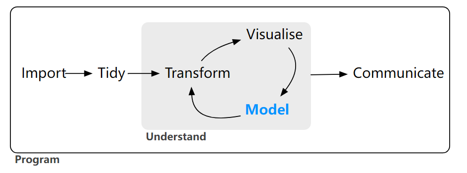
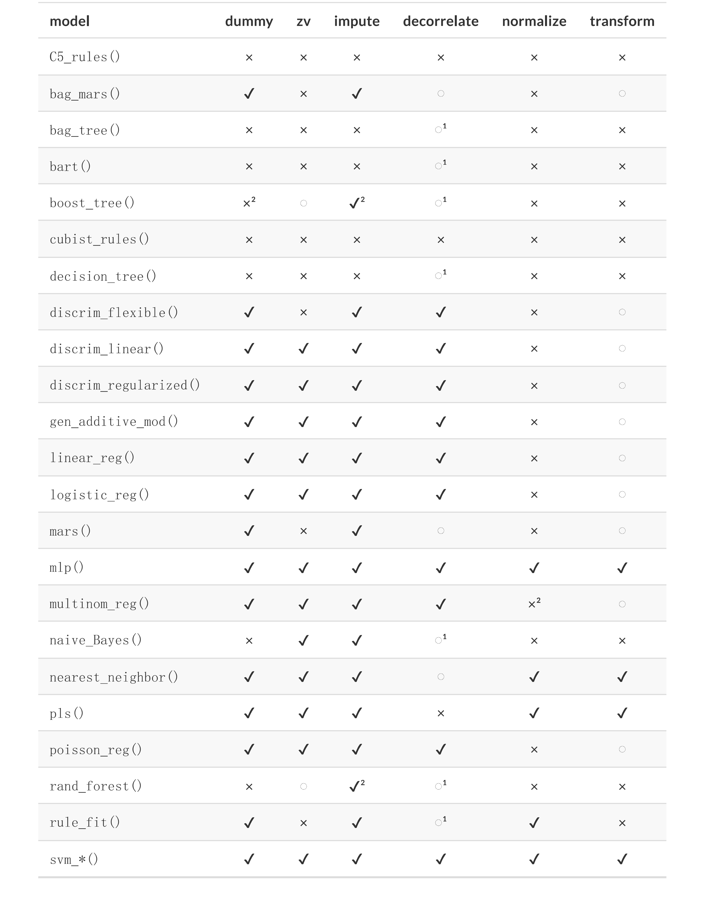
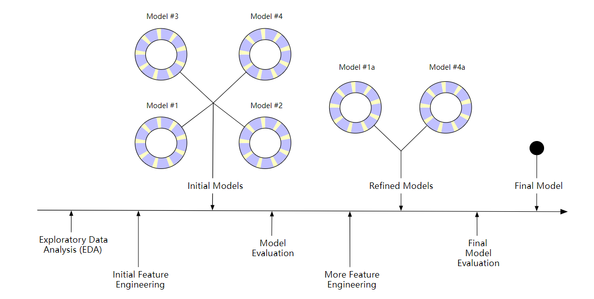
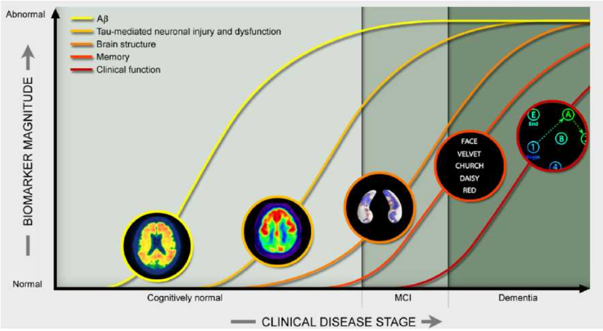
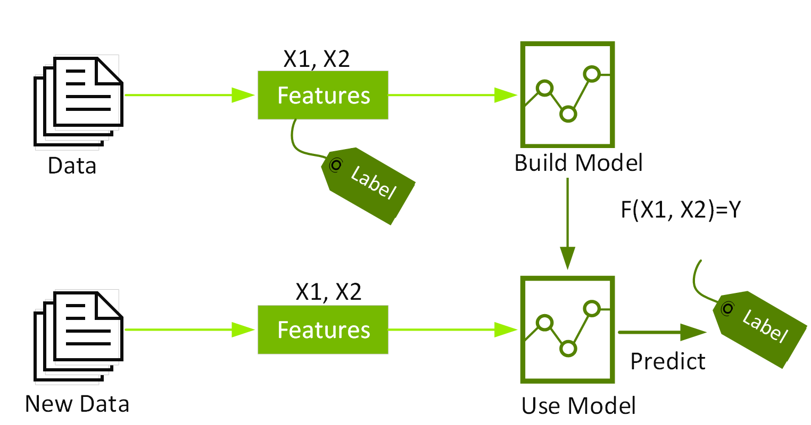
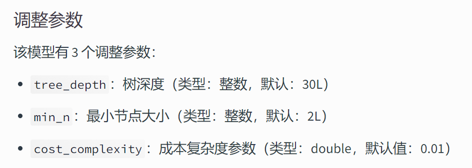
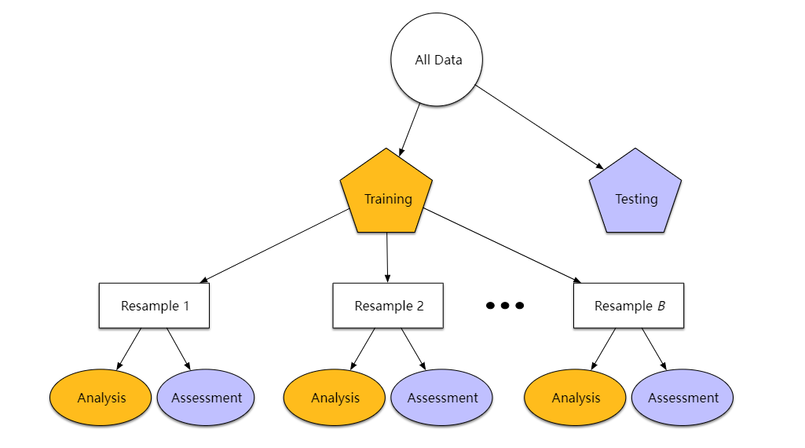

对于所有的数据表，我们对所需的共有变量名进行解释

```{r message=FALSE, warning=FALSE}
library(readxl)
library(rcompanion)
library(readxl)
library(dplyr)
library(ellipse)
library(RColorBrewer)
library(tidyverse)
# library(kableExtra)
library(gt)
```

# 生物标志物的研究

## 分析框架

```{r setup, include=FALSE}
knitr::opts_chunk$set(
	echo = TRUE,
	message = FALSE,
	warning = FALSE
)
library(tidyverse)
library(tidymodels)
library(pheatmap)
library(corrr)
library(shiny)
library(readxl)
library(writexl)

library(patchwork) # 将几张图绘制在一起
library(plotly) # heatmaply前置
library(viridis) # heatmaply前置
library(heatmaply) #热图
library(car) # scatterplotMatrix函数
library(RColorBrewer) #颜色包
```

```{r}
knitr::include_graphics("pic/tidyverse.png")


```

```{r message=FALSE, warning=FALSE, paged.print=TRUE}
fir_files <- list.files("data/first", pattern = "\\_31Oct2023.csv$", full.names = TRUE)
dig_files <- list.files("data/Diagnosis", pattern = "\\_31Oct2023.csv$", full.names = TRUE)
psy_files <- list.files("data/Neuropsychological", pattern = "\\.csv$", full.names = TRUE)
# view(fir_files)

all_files <- c(fir_files,dig_files,psy_files)
dir <- read_csv("data/DATADIC_31Oct2023.csv") #读入字典

Total <- list()
Name <- list()

# for (i in all_files) {
#   Total[[i]] <- read_csv(i)
#   # Name[[i]] <- colnames(Total[[i]])
# }
CT <- read_csv(all_files[1])
Golden <- read_csv(all_files[6])
```

```{r}
# Total_name<- list()
# # 新建一个原始顺序数据列表B，其中i位置元素为第i个表的列名数据框
# B <- list()
# 
# for (i in all_files) {
#   B <- as.tibble(colnames(Total[[i]]))|> rename("FLDNAME" = value)
#   
#   Total_name[[i]] <- 
#     dir |> 
#     # filter(PHASE %in% Total[[i]]$PHASE) |> #有的表没有phase...太不tidy了
#     filter(FLDNAME %in% B[[1]]) |> 
#     distinct(FLDNAME,.keep_all = TRUE) |> 
#     select(4:6) %>% 
#     left_join(B,.,by = "FLDNAME") |>   #左连接
#     t() |> 
#     as.tibble() #把所有表的英文释义导入一个list
#   
# }

# for (i in 1:28) {
#   Total_name[[i]] |> write_xlsx(str_c("data/trans/",i,"_trans.xlsx"))
# } # 将列表中的每个释义表导出

# # 正则表达式：
# all_files <- str_remove_all(all_files, "data/")
# all_files <- str_replace_all(all_files, "/", "_")
# all_files <- str_replace_all(all_files, ".csv", "")
# all_files <- str_replace_all(all_files, "_31Oct2023", "")

# location2 <- str_c("data/binds/",1:28,all_files,".xlsx")
# 
# location2 <- as.tibble(location2)
# write_xlsx(location2)
# 
# for (i in 1:28) {
#   Total[[i]] |> write_xlsx(str_c("data/binds/",i,all_files[i],".xlsx"))
# }

# t(Total_name[[1]])
```

链接整合数据时，应注意以下几点：

1.  按照RID与vistcode进行连接，以确保检测的时齐性

2.  筛去T2_QC_R、T2_QC_L两列中图像质量为（-1）"不可用"列的数据

3.  链接完成后，进行缺失值检验

```{r}
Golden <- read_csv(all_files[6]) |> 
  dplyr::select(3,6,7,12,13,44) 
  
colnames(Golden)
CT_name <- CT |> select(2,3,4)
CT_Golden <- CT |> 
  left_join(Golden, by = c("RID","VISCODE","VISCODE2")) |> #按照vistcode进行连接
  relocate(59:61) 

CT_Golden <- CT_Golden |> filter(!is.na(DIAGNOSIS)) |> 
  select(-1,-2)|> select(!2:8) |>  
  filter(T2_QC_R>0 & T2_QC_L>0) |> #筛掉图像质量不可用的行
  dplyr::select(-T2_QC_R,-T2_QC_L,-update_stamp) #去掉图像质量、时间戳所在列

CT_Golden |> count(DIAGNOSIS)
```

## 数据预处理

1.  dummy: 质量预测变量是否需要数值编码（例如，通过虚拟变量或其他方法）？

2.  zv: 是否应该删除只有单一唯一值的列？

3.  impute: 如果变量缺失，是否应该通过插补进行估算？

4.  decorrelate: 如果存在相关的预测变量，是否应该减轻这种相关性？这可能意味着过滤掉一些预测变量，例如使用主成分分析，或者采用基于模型的技术（例如正则化）。

5.  normalize: 预测变量是否应该进行中心化和缩放？

6.  transform: 将预测变量转换为更对称的形式（如对数变换）是否有助于分析？

```{r}

```

**带着这些问题，我们对表1（PIC）中的数据进行了以下处理：**

1.  删除可能错误的离群值

    ```{r}
    qnorm(0.99999)
    check <- function(x){
      ifelse(
        abs((x - mean(x,na.rm = TRUE)) / sd(x, na.rm = TRUE)) > qnorm(0.99999)
        ,1,0
      )
    }
    # view(CT_Golden)
    Abnormal <- CT_Golden |> mutate(Number = 1:nrow(CT_Golden)) |> 
      mutate_at(vars(-DIAGNOSIS,-Number),check) |> 
      select(Number,ends_with("VOL")) |> select(-LEFT_CA2_VOL) |>  
      filter_at(vars(-Number),any_vars(. !=0)) 
    Abnormal$Number
    # ?which()
    # view(Abnormal)
    # colnames(Abnormal)
    SEE <- CT_Golden |> mutate(Number = 1:nrow(CT_Golden)) |> 
      filter(Number %in% Abnormal$Number) |> relocate(Number)
    # view(SEE)
    ```

    ```         
    发现233、314号的LEFT_MISC_VOL，10、11号的LEFT_SULCUS_VOL，
    以及305号的整个右半脑体积 均出现显著异常
    ```

    ```{r}
    SEE |> select("DIAGNOSIS","LEFT_MISC_VOL","LEFT_SULCUS_VOL",starts_with("R"))
    ```

    前两行（10、11）可认为患者疾病十分严重，导致左沟回体积增大，予以保留

    其余三行(233,314,305)暂时未知异常原因，选择整行删除

2.  检验数据主要缺失列LEFT_CA2_VOL、LEFT_CA2_NS与响应变量之间的相关性

    ```{r}
    cor(CT_Golden$LEFT_CA2_VOL,CT_Golden$LEFT_CA2_NS,method = "spearman")
    cramerV(CT_Golden$LEFT_CA2_VOL,CT_Golden$DIAGNOSIS)
    ```

发现LEFT_CA2_VOL、LEFT_CA2_NS之间相关性强，但与响应变量DIAGNOSIS之间相关性弱，选择整列删除

```{r}
CT_Golden <- CT_Golden[-c(233,314,305),]
CT_Golden <- CT_Golden |> 
  select(-LEFT_CA2_VOL,-LEFT_CA2_NS) 
```

## 探索性数据分析

### 相关性热图及系统聚类图

```{r fig.height=5, fig.width=8, message=FALSE, warning=FALSE}
all_files <- c(fir_files,dig_files,psy_files)
mat <- CT_Golden |> select(-DIAGNOSIS) |> 
  cor(method ="spearman")

p <- heatmaply(mat, 
               xlab = "", ylab = "", 
               main = "",
               symm = TRUE,
               k_col = 6,
               k_row = 4,
               grid_color = "white",
               grid_width = 0.00001,
               titleX = FALSE,
               branches_lwd = 0.6,
               label_names = c("y", "x", "Corr"),
               fontsize_row = 6, fontsize_col = 6,
               labCol = colnames(mat),
               labRow = rownames(mat),
               heatmap_layers = theme(axis.line=element_blank()),
               hide_colorbar = TRUE
)
p

```

由热力图可知CA与CA1之间联系紧密

### D3网络图

```{r}
# install.packages("networkD3")
library(networkD3)
# Name <- CT |> filter(T2_QC_R!=-1 & T2_QC_L!=-1) |> 
#   dplyr::select(8:55) |> colnames() |> as_tibble()
Name <- CT_Golden |> select(-DIAGNOSIS) |> colnames() |> as_tibble()
Group <- Name  |> mutate(sp = value) |> 
  separate_wider_delim(
    sp,
    delim = "_", names = c("Side", "Area","Type")
    ) 
Group |> count(Area)
Vol <- Group |> filter(Type == "VOL")
name <- Vol$value
```

由分区count可以看出各区域采样均衡，左右\*（N/V）共四个

```{r message=FALSE, warning=FALSE, include=FALSE}
# 热图聚类导出
a <- pheatmap(mat, cluster_rows = T, cluster_cols = T)
# ?pheatmap
# 重新排列行和列
mat_cluster <- mat[a$tree_row$order, a$tree_col$order]
# 分k类，导出分类信息
row_cluster <- cutree(a$tree_row, k=6)
name <- names(row_cluster)
group <- unname(row_cluster)
```

```{r fig.height=8, fig.width=7}

df <- tibble(
  脑区 = name,
  # group = group,
  # group = Group$Side,
  group = Group$Area,
  # group = Group$Type,
) |> mutate(source = 0:45) |> relocate(source)
df

# 制作mislinks矩阵
# M <- CT |> filter(T2_QC_R!=-1 & T2_QC_L!=-1) |> 
#   dplyr::select(8:55) 
M <- CT_Golden |> select(-DIAGNOSIS)
# 编号从零开始
colnames(M) <- 0:45
library(corrr)
Mislinks <- M|> correlate(method ="spearman") |> shave() |> 
  pivot_longer(cols = -1) |>
  drop_na() |> 
  dplyr::rename(source = term,target = name) |> 
  # filter(value > 0.5) |> 
  filter(value > 0.7) |> 
  mutate(长度 = round((1-value)*10,1)) |> 
  filter(长度> 0)
# str(Mislinks)

N <- Mislinks |> count(source) |> mutate(source = as.integer(source))
Nodes <- df |> left_join(N,by = "source") |> as.data.frame()

library(networkD3)
forceNetwork(Links = Mislinks, Nodes = Nodes, Source = "source",
             Target = "target",  NodeID = "脑区",
             Value = "长度",
             Group = "group", opacity = 0.8,
             bounded = TRUE,
             Nodesize = "n",
             fontSize = 20,
             zoom = TRUE,
             legend = TRUE
            )
```

从上图中可以看出：

1.  VOL后缀的 左右 相关性强，颜色成对出现

2.  NS后缀的连线更多，左右相关性弱，但不同区域间相关性更强，

## 模型建立与选择

### 模型框架搭建

```{r fig.height=4, fig.width=7}
knitr::include_graphics("pic/tidyverse.png")
knitr::include_graphics("pic/tidymodels.png")

```

```{r}

```

目标：建立合适的三分类模型，以脑区体积/切片数为输入，输出分类结果

数据采样：rsample

```{r}

```

```{r}
# 数据采样：rsample
set.seed(658)
CT_split <- CT_Golden  |> 
  mutate(DIAGNOSIS = as.factor(DIAGNOSIS)) |> # 响应变量转换为因子类型 
  initial_split(strata = DIAGNOSIS) #按照病情分层抽样
CT_split
```

数据标准化：

```{r}
# 数据标准化
CT_recipe <- CT_split |>  
  training() %>%
  recipe(DIAGNOSIS ~.) %>% #启动一组要应用的新转换，类似于 ggplot() 命令
  step_corr(all_predictors()) %>% # 删除与其他变量具有较大绝对相关性(0.9)的变量
  step_center(all_predictors(), -all_outcomes()) %>% #标准化数值数据，使其均值为零
  step_scale(all_predictors(), -all_outcomes()) %>% #标准化数值数据，使其标准差为 1
  prep() #在提供的数据（通常是训练数据）之上执行转换

CT_recipe
# 执行预处理
```

至此，我们一开始提出的六个问题已经全部解决

1.  dummy: 质量预测变量是否需要数值编码（例如，通过虚拟变量或其他方法）？

2.  zv: 是否应该删除只有单一唯一值的列？

3.  impute: 如果某些变量缺失，是否应该通过插补进行估算？

4.  decorrelate: 如果存在相关的预测变量，是否应该减轻这种相关性？这可能意味着过滤掉一些预测变量，例如使用主成分分析，或者采用基于模型的技术（例如正则化）。

5.  normalize: 预测变量是否应该进行中心化和缩放？

6.  transform: 将预测变量转换为更对称的形式是否有助于分析？

解决方案：

1.  dummy: 防风草包的fit函数自动转换为哑变量/因子

2.  zv：无单一唯一值列，且已清除无法解释的异常值

3.  impute: 数据集中缺失列已整列删除，防止了插补带来的负面影响

4.  decorrelate: 强相关性变量已删除，仅保留一个

5.  normalize: 已进行标准化处理

6.  transform: 无需取对数处理

接下来，我们把模型封装进函数，准备拟合

```{r}
CT_test_r <- CT_recipe |> 
  bake(CT_split |> testing())
# 将准备好的训练数据加载到变量中，我们使用juice()
CT_train_r <- juice(CT_recipe)

# 把模型验证部分封装进函数
Test <- function(data,CT_testing){
  a <- data |> predict(CT_testing, type = "prob") |> 
    bind_cols(CT_testing) |> 
    roc_auc(truth = DIAGNOSIS, .pred_1:.pred_3)
  
  data |> predict(CT_testing) |> 
    bind_cols(CT_testing) |> 
    metrics(truth = DIAGNOSIS,estimate = .pred_class) |> 
    bind_rows(a)
}

```

例子：使用随机森林模型

```{r}
# 例子：
# 使用随机森林模型
CT_rf <-  rand_forest(trees = 100) %>%
  set_mode("classification") %>% 
  set_engine("randomForest") %>%
  fit(DIAGNOSIS ~ ., data = CT_train_r)
# 调用评估函数
CT_rf |> Test(CT_test_r)
```

hand_till为多类别auc的平均值

### 分类模型的性能比较

框架搭设完毕，开始批量打表

```{r}
# 框架搭设完毕，开始批量打表
Table <- read_xlsx("data/model_engine.xlsx")
Table
model <- Table$Model
engine <- Table$Engine
```

```{r}
Funct <- list() 
Fit <- list() 
for (i in 1:12 ) {
  a <- str_c(model,"()")[i]
  Funct[[model[i]]] <- 
    eval(parse(text = a)) |> set_mode("classification") %>% 
    set_engine(engine[i])
} # 模型函数导入list：Funct
library(discrim) #部分模型匹配引擎要用
for (i in 1:12) {
  Fit[[model[i]]] <- Funct[[model[i]]] |> 
    fit(DIAGNOSIS ~ ., data = CT_train_r)
} #拟合后的模型导入list：Fit

```

调用Fit[[i]]可以直接查看第i个模型的具体情况，如查看7号模型随机森林：

```{r}
Fit[[7]]
```

至此，所有的准备工作已经准备完毕

参赛选手：1-12号多分类模型

不同引擎数量：10

比赛规则：所有模型均采用初始参数

胜利规则：更准的accuracy，更大的kappa，更好看的roc曲线

比赛开始！

```{r}
knitr::include_graphics("pic/set_engine.png")

```

```{r warning=FALSE}
Accuracy <- tibble()
Kappa <- tibble()
Roc <- tibble()
E <- list()
for (i in 1:12) {
  E[[i]] <- Fit[[model[i]]] |> Test(CT_test_r)
  Accuracy <- rbind(Accuracy,E[[i]][1,])
  Kappa <- rbind(Kappa,E[[i]][2,])
  Roc <- rbind(Roc,E[[i]][3,])
}
Accuracy <- Accuracy |> dplyr::rename(accuracy = .estimate)
Kappa <- Kappa |> dplyr::rename(kappa = .estimate)
Roc <- Roc |> dplyr::rename(roc_auc = .estimate)

Result <- cbind(Table,Accuracy,Kappa,Roc) |> 
  dplyr::select(Model,Engine,accuracy,kappa,roc_auc,Explain) 
Result |> arrange(desc(accuracy))
```

```{r}
Result |> arrange(desc(roc_auc))
```

可以看到KNN模型在accuracy、kappa双赛道取得第一，基于xgboostd增强树获得了最高的roc_auc面积！

```{r warning=FALSE}
Draw <- function(data,CT_testing){
  data |> predict(CT_testing, type = "prob") |> 
    bind_cols(CT_testing) |> 
    roc_curve(DIAGNOSIS,.pred_1:.pred_3) %>% 
    autoplot()
} # 把绘制ROC曲线封装进函数：Draw
# 画一下ROC曲线
Fit[[model[1]]] |> Draw(CT_test_r)

```

发现MCI的拟合效果较差，为探究是否为模型原因，我们绘制出所有模型的ROC曲线

```{r fig.height=10, fig.width=14, warning=FALSE}
# 批量绘图
ROC <- list() 
for (i in 1:12) {
  ROC[[i]] <- Fit[[model[i]]] |>
    Draw(CT_test_r) + labs(x = model[i])
}
wrap_plots(ROC, ncol = 3) 
```

可以看出MCI较低并非模型原因，基本所有的模型在3-AD的预测效果较优，其次是1-NL，对于2-MCI的人群预测效果较差，考虑模型拟合

## 决策树模型的调参优化

选择原因：可解释性最强

### 参数选择：格点法

```{r echo=TRUE, message=TRUE, warning=FALSE}
set.seed(1222)
CT_split <- CT_Golden  |> 
  mutate(DIAGNOSIS = as.factor(DIAGNOSIS)) |> # 响应变量转换为因子类型 
  initial_split(strata = DIAGNOSIS) #按照病情分层抽样
CT_split
CT_test <- CT_split |> testing()
CT_train <- CT_split |> training()
CT_dt <- decision_tree() %>% 
  set_engine("rpart") %>% 
  set_mode("classification") |> 
   fit(DIAGNOSIS ~ ., data = CT_train)
CT_dt |> Test(CT_test)
CT_dt |> Draw(CT_test)
```

未经调参的效果可以说是惨不忍睹

决策树模型不要求模型标准化，且对多重共线性不敏感，

为保留解释性，此处对原数据不进行标准化

```{r include=FALSE}
set.seed(658)
CT_split <- CT_Golden  |> 
  mutate(DIAGNOSIS = as.factor(DIAGNOSIS)) |> # 响应变量转换为因子类型 
  initial_split(strata = DIAGNOSIS) #按照病情分层抽样
CT_split
# 决策树模型不要求模型标准化，且对多重共线性不敏感，
# 为保留解释性此处不去进行标准化

CT_test <- CT_split |> testing()
# 将准备好的训练数据加载到变量中，我们使用juice()
CT_train <- CT_split |> training()


CT_dt <- decision_tree(
  # cost_complexity = 1e-10,
  # tree_depth = 4 ,
  # min_n = 2
) %>% 
  set_engine("rpart") %>% 
  set_mode("classification") |> 
   fit(DIAGNOSIS ~ ., data = CT_train)
CT_dt |> Test(CT_test)
# 调用评估函数
CT_dt |> Draw(CT_test)
```

```{r}

```

```{r}
tune_spec <- 
  decision_tree(
    cost_complexity = tune(),
    tree_depth = tune()
  ) %>% 
  set_engine("rpart") %>% 
  set_mode("classification")
# tune()为标识我们计划调整哪些超参数
tune_spec

```

基于tune提供的网格方法，可以进行组合调参

首先选择cost_complexity()与 tree_depth()这两个变量

```{r}
# 进行网格调参：
tree_grid <- grid_regular(cost_complexity(),
                          tree_depth(c(2,6)),
                          levels = 5)
# ?grid_regular
# 返回25种组合
# tree_grid
tree_grid %>% 
  count(tree_depth)
```

### 调参标准：5折交叉验证

```{r}

```

由于数据量较小，维度较高，选取五折交叉验证更为稳健：

```{r}
set.seed(156)
CT_folds <- vfold_cv(CT_train,5) #5折
CT_folds
```

现在对于上述五个数据集，取四个拟合其中一个，循环遍历取平均值，并打表：

```{r}
tree_wf <- workflow() %>%
  add_model(tune_spec) %>%
  add_formula(DIAGNOSIS ~ .)

tree_res <- 
  tree_wf %>% 
  tune_grid(
    resamples = CT_folds,
    grid = tree_grid
  )

tree_res
collect_metrics(tree_res)
```

表格难以阅读，画图进行可视化：

```{r}
tree_res %>%
  collect_metrics() %>%
  mutate(tree_depth = factor(tree_depth)) %>%
  ggplot(aes(cost_complexity, mean, color = tree_depth)) +
  geom_line(size = 1.5, alpha = 0.6) +
  geom_point(size = 2) +
  facet_wrap(~ .metric, scales = "free", nrow = 2) +
  scale_x_log10(labels = scales::label_number()) +
  scale_color_viridis_d(option = "plasma", begin = .9, end = 0)
```

```{r}
tree_res %>%
  show_best("accuracy",5)
```

可以看出cost_complexity 在较低时达到accuracy最高，且十分平稳

因此以cost_complexity = e-10，选取树深度、树节点进行调参

```{r}
tune_spec <- 
  decision_tree(
    min_n = tune(),
    tree_depth = tune(),
    cost_complexity = 1e-10
  ) %>% 
  set_engine("rpart") %>% 
  set_mode("classification")
# tune()为标识我们计划调整哪些超参数
tune_spec
# 进行网格调参：
tree_grid <- grid_regular(min_n(c(2,6)),
                          tree_depth(c(2,6)),
                          levels = 5)
# 返回25种组合
tree_grid
tree_grid %>% 
  count(tree_depth)

tree_wf <- workflow() %>%
  add_model(tune_spec) %>%
  add_formula(DIAGNOSIS ~ .)

tree_res <- 
  tree_wf %>% 
  tune_grid(
    resamples = CT_folds,
    grid = tree_grid
  )
tree_res %>%
  collect_metrics() %>%
  mutate(tree_depth = factor(tree_depth)) %>%
  ggplot(aes(min_n, mean, color = tree_depth)) +
  geom_line(size = 1.5, alpha = 0.6) +
  geom_point(size = 2) +
  facet_wrap(~ .metric, scales = "free", nrow = 2) +
  scale_x_log10(labels = scales::label_number()) +
  scale_color_viridis_d(option = "plasma", begin = .9, end = 0)
```

最终确定我们的模型：选取accuracy最高：

```{r}
# 最终确定我们的模型
best_tree <- tree_res %>% 
  # select_best("roc_auc")
  select_best("accuracy")
best_tree

```

最终模型参数：

```{r}
# 最终确定我们的模型
final_wf <- 
  tree_wf %>% 
  finalize_workflow(best_tree)
final_wf
```

在测试集上进行最后一次拟合：

```{r}
# 最后一次拟合
final_fit <- 
  final_wf %>%
  last_fit(CT_split)
# last_fit():此函数拟合完整训练数据集上的最终模型并评估基于测试数据的最终模型
final_fit %>%
  collect_metrics()

final_fit %>%
  collect_predictions() %>% 
  roc_curve(DIAGNOSIS,.pred_1:.pred_3) %>% 
  autoplot()

```

可以看出经过调参，roc曲线得到明显改善

```{r message=FALSE, warning=FALSE}
library(rpart.plot)  # for visualizing a decision tree
library(vip)         # for variable importance plots

```

### 模型结论

生成最终树：决策规则可视化

```{r}
# 生成最终的树
final_tree <- extract_workflow(final_fit)

# 决策可视化
final_tree %>%
  extract_fit_engine() %>%
  rpart.plot(roundint = FALSE)


```

最后根据模型的结构来估计变量重要性

```{r}
# 可以使用vip包
final_tree %>% 
  extract_fit_parsnip() %>% 
  vip()
```

可以看出：

1.  CA区与CA1区的体积变化最能反应患者患病情况

2.  对于预测结果，左脑比右脑更为显著
